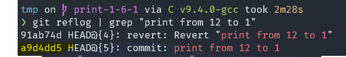

# Exercise 2

## Walkthrough

1. Make a dir, **exercise-2**, and open it in vscode.
```shell
mkdir exercise-2 && code exercise-2
```
2. Open the terminal of vscode and create a repository and run **git status** and **git log**
```shell
git init
```
```shell
git status
```
```shell
git log
```
3. Create **README.md** and write **# Exercise 2**
```shell
echo "# Exercise 2" > README.md
```
4. Create **.gitignore** and ignore all **.txt** files.
```shell
echo "*.txt" > .gitignore
```
5. Add changes to the staging area
```shell
git add .
```
6. Make a commit with the message "Init commit"
```shell
git commit -m "Init commit"
```
7. Run **git status**, **git log** and **git log --oneline**.
```shell
git status
```
```shell
git log
```
```shell
git log --oneline
```
8. Remove **README.md** using **git rm**
```shell
git rm README.md
```
9. Run ** git status** and then unstage the change using **git restore**
```shell
git status
```
```shell
git restore --staged README.md
```
10. Run **git status** and **discard** the changes using **git restore**
```shell
git status
```
```shell
git restore README.md
```
11. Instead of all **.txt** files, ignore all files without **.c, .md** or **.sh** extensions.

Open your .gitignore file with a text editor and change the content to 
```
# Ignores every file
*

# Excludes every file with the .c extensions from the ignore
!*.c
# Excludes every file with the .sh extensions from the ignore
!*.sh
# Excludes every file with the .md extensions from the ignore
!*.md
```
or if you want to use printf 
```shell
printf '*\n!*.c\n!*.md\n!*.sh' > .gitignore
```
12. Run **git status** and add **.gitignore** 
```shell
git status && git add .gitignore
```
13. Create two files, **main.c** and **run.sh**
```shell
touch main.c run.sh
```
14. Write the below code with printf to run.sh

clear && gcc main.c -o main && ./main
```shell
printf "clear && gcc main.c -o main && ./main" > run.sh
```
15. Write the below code with printf to main.c

#include <stdio.h>\n\nint main(void) \n{\n\treturn 0;\n}
```shell
printf "#include <stdio.h>\n\nint main(void) \n{\n\treturn 0;\n}" > main.c
```
Alternatively, open main.c with a text editor and type the following:
```c
#include <stdio.h>

int main(void)
{
	return 0;
}
```
16. Run **git status** and add changes to staging area.
```shell
git status
```

```shell
git add .
```
17. **Commit** changes with the message "**First commit**"
```shell
commit -m "First commit"
```
18. Run **sh run.sh** in the terminal. Has the executable file (**main.exe** or **main**) been ignored?
```shell
sh run.sh
```
The executable file should be ignored by git


19. Run **git log**. Change the message of the last commit to "**Created main.c and run.sh**
```shell
git commit --amend -m "Created main.c & run.sh"
```
20. Add a **note** *The program and its compilation*, to the last commit.
```shell
git notes add -m "The program and its compilation"
```
21. Create a **branch**, *feature-branch*, based on the *master* branch.
```shell
git branch feature-branch
```
22. Create another **branch**, *print-1-6-1*, based on the *master* branch.
```shell
git branch print-1-6-1
```
23. Get the list of branches using **git branch**
```shell 
git branch
```
24. **Rename** *feature-branch*  to **print-1-3-1**
```shell
git branch feature-branch -m print-1-3-1
```
25. Get the list of branches using **git branch**
```shell 
git branch
```
26. **Switch** to **print-1-3-1** branch and run **git log --oneline**
```shell
git switch print-1-3-1
```
```shell
git log --oneline
```
27. In **main.c** make a program using a **for loop** to **print from 1 to 3** to the output.

open main.c with a text editor and change the content to:
```c
#include <stdio.h>

int main(void)
{
	for (int i = 1; i < 4; i++)
	{
		printf("%d ", i);
	}
	printf("\n");

	return 0;
}
```
28. Run **sh run.sh** in the **terminal** to make sure the program works.
```shell
sh run.sh
```
should print ```1 2 3 ``` to the console.

29. Run **git status** and **add** the changes to the staging area.
```shell
git status
```
```shell
git add .
```
30. **Commit** the changes with the message "**print from 1 to 3**". Run **git log --oneline**.
```shell
git commit -m "print from 1 to 3"
```
```shell
git log --oneline
```
31. Now **switch** to *master* and run **git log --oneline**
```shell
git switch master
```
```shell
git log --oneline
```
32. What is the **difference** between *master* and *print-1-3-1*?

`git diff <branch-name>` will print out all the differences between our 
current branch and <branch-name>.
```shell
git diff print-1-3-1
```
33. **Switch** to *print-1-3-1* and run **git status**
```shell
git switch print-1-3-1 && git status
```
34. In **main.c** make a **for loop** after the previous loop to **print from 2 to 1** to the output

open main.c with a text editor and change the content to:
```c
#include <stdio.h>

int main(void)
{
	for (int i = 1; i < 4; i++)
	{
		printf("%d ", i);
	}

	for (int i = 2; i > 0; i--)
	{
		printf("%d ", i);
	}
	printf("\n");

	return 0;
}
```
35. Run **sh run.sh** in the **terminal** to make sure it runs.
```shell
sh run.sh
```
36. **Commit** the changes with the message "**print from 2 to 1**" and run **git log --oneline**
```shell
git commit -a -m "print from 2 to 1" && git log --oneline
```
37. In the last loop change your code in order to print from **12 to 1**.

open main.c with a text editor and change the content to:
```c
#include <stdio.h>

int main(void)
{
	for (int i = 1; i < 4; i++)
	{
		printf("%d ", i);
	}

	for (int i = 12; i > 0; i--)
	{
		printf("%d ", i);
	}
	printf("\n");

	return 0;
}
```
38. Run **sh run.sh** in the **terminal** to make sure the program works.
```shell
sh run.sh
```
39. **Commit** the changes with the message "**print from 12 to 1**" and run **git log --oneline**
```shell
git commit -a -m "print from 12 to 1" && git log --oneline
```
40. **Revert** the last commit with the message "**Revert print from 12 to 1**". Run **git log --oneline**
```shell
git revert HEAD
```
And change the message to *Revert "print from 12 to 1"*

```shell
git log --oneline
```
41. Then **hard reset** the branch to the commit with the message "**print from 2 to 1**"
```shell
git reset --hard <commit-id>
```
42. **Merge** *print-1-3-1* with *master* with the message "**print from 1 to 3 to 1**"

First switch to the branch you want the other branch to merge into (master in our case)
```shell
git switch master 
```
Either run 
```shell
git merge --squash print-1-3-1 && git commit -m "print from 1 to 3 to 1"
```
Or 
```shell 
git merge print-1-3-1
```
The squash command will result in the output they asked for. The regular 
merge will lead to the same log as the one they had in the exercise.

43. Run **git log --oneline**. Delete branch *print-1-3-1* and run **git branch**.
```shell 
git log --oneline
```
```shell 
git branch -D print-1-3-1
```
```shell 
git branch
```
44. **Switch** to *print-1-6-1* and run **git log --oneline**
```shell
git switch print-1-6-1 && git log --oneline
```
45. use **git cherry-pick** and add the commit with message "**print from 12 to 1**"

I could not remember what the commit id was so 
```shell
git reflog | grep "print from 12 to 1"
```
should return something like 



```shell
git cherry-pick <commit-id>
```
The following combines all steps above
```shell
git cherry-pick $(git reflog | grep "commit: print from 12 to 1" | awk '{print $1}')
```
46. Is there is a conflict? Solve it such that the program counts from 1 to
and then 5 to 1.

I had a conflict.
```c
#include <stdio.h>

int main(void)
{
<<<<<< HEAD
======
	for (int i = 1; i < 4; i++)
	{
		printf("%d", i);
	}

	for (int i = 12; i > 0; i--)
	{
		printf("%d", i);
	}
	printf("\n");

>>>>>> <commit id> (print from 12 to 1)
	return 0;
}
```
Accept incoming change & modify code.
```c
#include <stdio.h>

int main(void)
{
	for (int i = 1; i < 7; i++)
	{
		printf("%d", i);
	}

	for (int i = 5; i > 0; i--)
	{
		printf("%d", i);
	}
	printf("\n");

	return 0;
}
```
47. Run **git status** and **add** the changes to the staging area.
```shell
git status
```
```shell
git add .
```
48. **Commit** changes with the message "**print from 1 to 6 to 1**"
```shell
git cherry-pick --continue
```
Change the message to "**print from 1 to 6 to 1**".
You could also use a regular `git commit -m "print from 1 to 6 to 1"`

49. Add a comment, "**//print from 1 to 6 to the output**",
to the first loop in main.c
```c
#include <stdio.h>

int main(void)
{
	//print from 1 to 6 to the output
	for (int i = 1; i < 7; i++)
	{
		printf("%d", i);
	}

	for (int i = 5; i > 0; i--)
	{
		printf("%d", i);
	}
	printf("\n");

	return 0;
}
```
50. Add a comment, "**//print from 5 to 1 to the output**",
to the second loop in main.c
```c
#include <stdio.h>

int main(void)
{
	//print from 1 to 6 to the output
	for (int i = 1; i < 7; i++)
	{
		printf("%d", i);
	}

	//print from 5 to 1 to the output
	for (int i = 5; i > 0; i--)
	{
		printf("%d", i);
	}
	printf("\n");

	return 0;
}
```
51. **Try** to switch to master. Is it possible? Use **git stash** 
to save the changes and then switch to master.
```shell
git switch master
```
Switching is not possible since we have uncommited changes 
in our repo.
```shell
git stash
```
```shell
git switch master
```
52. Run **git log --oneline** and then **switch to *print-1-6-1*
```shell
git log --oneline && git switch print-1-6-1
```
53. Use **git stash list** to get the list of stashes.
Then restore the stash using **git stash pop**
```shell
git stash list
```
```shell
git stash pop
```
54. **Add** the changes to the staging area and then commit them with the 
message "**Commented the code**".
```shell
git add .
```
```shell
git commit -m "Commented the code"
```
55. **Merge** *print-1-6-1* into *master* with the message 
"**count and print 1-6-1**"
```shell
git switch master
```
```shell
git merge print-1-6-1
```
56. Is there a conflict? solve it and use **git merge --continue**
to complete the merge. Run **git log --oneline**

There should be a conflict. If you open main.c with vscode 
you should be able to click "**Accept Incoming Changes**"
to solve the conflict.

```shell
git merge --continue
```
```shell
git log --oneline
```
57. **Delete** *print-1-6-1* and run **git branch** and 
**git log --decorate --graph --oneline**

```shell
git branch -D print-1-6-1
```
```shell
git branch
```
```shell
git log --decorate --graph --oneline
```
58. Add a tag, v1.0, to the last commit and run **git tag**
```shell
git tag v1.0
```
```shell
git tag
```
59. Run **git log**, **git log --oneline** and then add a message, 
*The first release*, to the tag.
```shell
git log
```
```shell
git log --oneline
```
```shell
git tag -f v1.0 -m "The first release"
```
60. Run **git tag** and **git tag -n** to show the tag and then
**delete** the tag.
```shell
git tag
```
```shell
git tag -n
```
```shell
git tag -d v1.0
```

